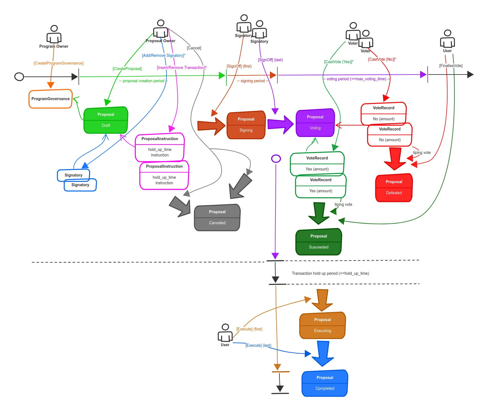

# 🌊 Terran Cove 1.0 (DAO)

## Scope

The following is the `Article of Governance` for the Blue Terra `DAO`. This is the Blue Terra `DAO` constitution. The Blue Terra `DAO` is to act in the best interest of the Blue Terra project and in the manner herein specified.&#x20;

## DAO Overview

After our mint, we will form a decentralized autonomous organization, or `DAO`, to serve as the governing body for our NFT holders and to select the initial officers of our Home Owner’s Association(`HOA`). Members of the `DAO` can colloquially be referred to as Terrans.

We will also be dedicating a significant percentage of exchange fees from our upcoming secondary market back to the `DAO`, to give back to our community members and enable the Blue Terran `DAO` to create new value for our holders: be it through more communal land development, a validator node to stake to, marketing partnerships etc.&#x20;

## Membership

To be a member of the `DAO`, holders would need to:

* Be a holder of a Blue Terra NFT (could not trade this NFT while a part of the organization)
* Verify on Discord with Grape Protocol.

## Formation

To qualify, one will simply need to hold a Blue Terra NFT in their Solana wallet. Exclusive Discord channels will be available through Grape Protocol.&#x20;

The inaugural `DAO` post mint will be responsible for the initialization of the `HOA`: including the election of an Interim President and Vice President, as well a temporary Board of Directors.&#x20;

## On Chain Governance

The Solana Blockchain is uniquely positioned to become the De facto player in on-chain DAO governance. Whereas some chains may charge significant gas fees to say create a DAO proposal, effectively inhibiting participation, the Solana makes on chain governance accessible to the masses. The ecosystem and Solana Foundation realize this at large and have been critical is building out the initial tooling. The most notable of which is The Solana [Governance Program](https://github.com/solana-labs/solana-program-library/tree/master/governance).&#x20;

It is Blue Terra's opinion that this program will and is becoming the standard in Solana DAO Governance. Consequently, some time after mint, we will setup the Governance Program for the Blue Terra DAO. High level, the Solana Governance Program primary mechanism or smart contract that allows Blue Terra NFT holders to draft, submit, sign and vote on  `Proposals.`

The `DAO` will have regular opportunities for members to submit and vote on `Proposals` for the future of the Blue Terra project. All `Proposals` are managed through the Blue Terra Solana Governance Program. All program proposals and resolutions will be documented in this Github [repo](https://github.com/Blue-Terra/blueterra-gitbook). After a Proposal has been voted on and passed, changes must be recorded on the following gitbook pages:

&#x20;1\) `Article of Governance` for the `HOA` .

2\) `Article of Governance` for the `DAO` .

Consequently, the Blue Terra `DAO` has complete control over `HOA` and proposals are the mechanism by which Blue Terra `HOA` and `DAO` Governance.&#x20;

The pipeline for `Proposals` contains three stages:

1\) `Compilation` - During this phase members of the `DAO` compile items into a `Proposal`. This `proposal` is compiled into a github branch containing these changes.&#x20;

2\) `Voting` -  Member of the `DAO` are given a window of time to vote of items in the `Proposal`.

3\) `Finalized` - After this given window of time, `DAO` the `Proposal` is finalized and the github branch containing the finalized `Proposal` is merged into the main branch of the repo.&#x20;

After the `Proposal` is merged, the gitbook will be updated and the changes to the Governance of Blue Terra changes take immediate effect.&#x20;

